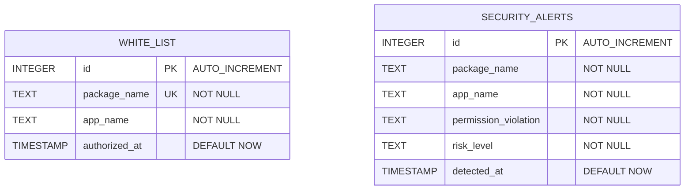
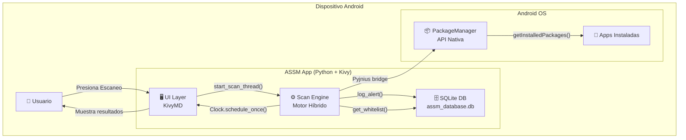
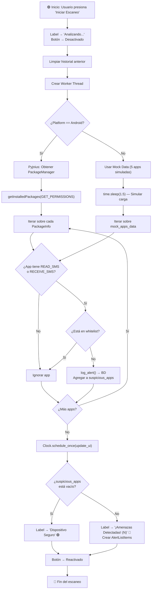
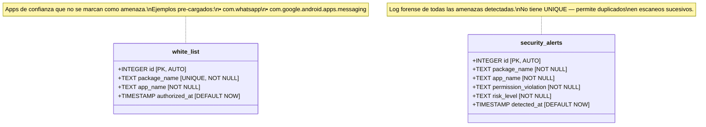

# Anti-Spyware-App-SMS
# 📱 ASSM — Anti-Spyware SMS Monitor
## Documentación Técnica Completa del Proyecto de Grado

---

## 📋 Tabla de Contenidos

1. [Visión General del Proyecto](#1-visión-general-del-proyecto)
2. [Stack Tecnológico](#2-stack-tecnológico)
3. [Estructura del Proyecto](#3-estructura-del-proyecto)
4. [Arquitectura de la Aplicación](#4-arquitectura-de-la-aplicación)
5. [FASE 1 — Capa de Datos (SQLite)](#5-fase-1--capa-de-datos-sqlite)
6. [FASE 2 — Interfaz de Usuario (KivyMD)](#6-fase-2--interfaz-de-usuario-kivymd)
7. [FASE 3 — Motor Híbrido de Escaneo (Pyjnius)](#7-fase-3--motor-híbrido-de-escaneo-pyjnius)
8. [Flujo Completo de Ejecución](#8-flujo-completo-de-ejecución)
9. [Modelo de Datos y Base de Datos](#9-modelo-de-datos-y-base-de-datos)
10. [Gestión de Hilos y Concurrencia](#10-gestión-de-hilos-y-concurrencia)
11. [Configuración de Buildozer](#11-configuración-de-buildozer)
12. [Compilación y Despliegue (APK)](#12-compilación-y-despliegue-apk)
13. [Análisis de Seguridad de la Propia App](#13-análisis-de-seguridad-de-la-propia-app)
14. [Mock Data y Modo Fallback (PC)](#14-mock-data-y-modo-fallback-pc)
15. [Análisis Línea por Línea del Código Fuente](#15-análisis-línea-por-línea-del-código-fuente)
16. [Diagrama de Arquitectura](#16-diagrama-de-arquitectura)
17. [Diagrama de Flujo de Escaneo](#17-diagrama-de-flujo-de-escaneo)
18. [Diagrama de la Base de Datos](#18-diagrama-de-la-base-de-datos)
19. [Limitaciones Actuales y Mejoras Futuras](#19-limitaciones-actuales-y-mejoras-futuras)
20. [Glosario Técnico](#20-glosario-técnico)

---

## 1. Visión General del Proyecto

### ¿Qué es ASSM?

**ASSM (Anti-Spyware SMS Monitor)** es una aplicación móvil de seguridad para Android, desarrollada en **Python** como proyecto de grado de **Tiffin University**. Su propósito es **detectar aplicaciones potencialmente espía** que solicitan permisos críticos de SMS (`READ_SMS`, `RECEIVE_SMS`) sin ser aplicaciones legítimas de mensajería.

### Problema que Resuelve

Muchas aplicaciones maliciosas (spyware) solicitan permisos de lectura e interceptación de SMS para:
- **Robar códigos de autenticación de dos factores (2FA/OTP)**
- **Interceptar transacciones bancarias** enviadas por SMS
- **Exfiltrar conversaciones privadas**
- **Realizar fraude de suscripciones premium (WAP billing)**

ASSM actúa como un **escáner de permisos** que identifica qué aplicaciones instaladas tienen acceso a estos permisos sensibles y **las marca como amenazas** si no están en una lista blanca de confianza.

### Público Objetivo

- Usuarios de Android preocupados por su privacidad
- Personas que descargan aplicaciones de fuentes externas (sideloading)
- Investigadores forenses digitales que necesitan auditoría de permisos

### Contexto Académico

| Campo           | Detalle                              |
|:----------------|:-------------------------------------|
| **Universidad** | Tiffin University                    |
| **Tipo**        | Proyecto de Grado                    |
| **Área**        | Ciberseguridad / Desarrollo Móvil    |
| **Lenguaje**    | Python 3                             |
| **Plataforma**  | Android (con fallback a PC)          |

---

## 2. Stack Tecnológico

### Lenguajes y Frameworks

| Tecnología        | Versión / Uso                          | Propósito                                                    |
|:------------------|:---------------------------------------|:-------------------------------------------------------------|
| **Python 3**      | 3.x                                   | Lenguaje principal de toda la aplicación                     |
| **Kivy**          | Framework base                         | Motor gráfico multiplataforma para interfaces                |
| **KivyMD**        | Extensión de Kivy                      | Componentes Material Design (botones, listas, barras)        |
| **SQLite3**       | Módulo estándar de Python              | Base de datos local embebida para whitelist y alertas        |
| **Pyjnius**       | Puente Python ↔ Java                  | Acceso nativo a la API de Android (`PackageManager`)         |
| **Buildozer**     | Herramienta de empaquetado             | Compilación cruzada de Python a APK de Android               |
| **python-for-android (p4a)** | Backend de Buildozer         | Toolchain que genera el APK final con Python embebido        |
| **threading**     | Módulo estándar de Python              | Ejecutar el escaneo en hilo separado (no bloquear UI)        |
| **logging**       | Módulo estándar de Python              | Registro de eventos y errores en consola                     |

### Dependencias Directas (Importaciones en `main.py`)

```python
import sqlite3           # Base de datos local
import os                # Rutas del sistema de archivos
import logging           # Registro de mensajes
import threading         # Hilos para escaneo async
import time              # Simulación de delays (mock)
from typing import List, Dict, Any  # Type hints

from kivy.clock import Clock                    # Scheduler de UI (main thread)
from kivy.lang import Builder                   # Parser del lenguaje KV
from kivy.utils import platform                 # Detectar si es Android o PC
from kivymd.app import MDApp                    # Clase base Material Design
from kivymd.uix.screenmanager import MDScreenManager  # Gestor de pantallas
from kivymd.uix.screen import MDScreen                # Pantalla individual
from kivymd.uix.list import TwoLineAvatarIconListItem, IconLeftWidget, IconRightWidget  # Listas
from kivy.core.window import Window             # Control de ventana (tamaño)
```

### Dependencia Condicional (Solo en Android)

```python
from jnius import autoclass  # Puente Python → Java (solo disponible en Android)
```

---

## 3. Estructura del Proyecto

```
Anti Spyware App/
├── main.py                          # Código fuente principal (369 líneas)
├── buildozer.spec                   # Configuración de compilación Android (vacío actualmente)
├── assm_database.db                 # Base de datos SQLite local (20 KB)
└── AntiSpyware-APK-FP/
    └── assm_monitor-1.0-arm64-v8a_armeabi-v7a-debug.apk  # APK compilado (~39 MB)
```

### Detalle de cada archivo

| Archivo / Directorio | Tamaño   | Descripción                                                                 |
|:----------------------|:---------|:----------------------------------------------------------------------------|
| [main.py](file:///c:/Users/leocu/OneDrive/Documentos/Tiffin%20University/Proyecto%20de%20Grado/Anti%20Spyware%20App/main.py) | 14.7 KB (369 líneas) | Todo el código fuente: datos, UI y motor de escaneo |
| [buildozer.spec](file:///c:/Users/leocu/OneDrive/Documentos/Tiffin%20University/Proyecto%20de%20Grado/Anti%20Spyware%20App/buildozer.spec) | 0 bytes (vacío) | Archivo de configuración de Buildozer (sin contenido actualmente) |
| `assm_database.db` | 20 KB | Base de datos SQLite con tablas `white_list` y `security_alerts` |
| `assm_monitor-1.0-arm64-v8a_armeabi-v7a-debug.apk` | ~39 MB | APK de debug compilado para arquitecturas ARM64 y ARMv7 |

---

## 4. Arquitectura de la Aplicación

La aplicación sigue un **patrón de 3 fases** claramente separadas dentro de un único archivo monolítico:

### Fase 1 — Capa de Datos
Funciones puras de acceso a SQLite. No tienen estado; reciben `db_path` como parámetro y abren/cierran conexiones atómicamente.

### Fase 2 — Interfaz de Usuario
Definida en lenguaje KV embebido como string multilínea (`KV`), con clases Python que extienden los widgets de KivyMD.

### Fase 3 — Motor Híbrido de Escaneo
Lógica de detección que usa **Pyjnius** en Android real o **Mock Data** en PC/emulador.

```
┌─────────────────────────────────────────────────┐
│                  main.py                        │
│                                                 │
│  ┌──────────────────────────────────────────┐   │
│  │  FASE 1: Capa de Datos (SQLite)          │   │
│  │  • get_db_connection()                   │   │
│  │  • init_db()                             │   │
│  │  • add_to_whitelist()                    │   │
│  │  • get_whitelist()                       │   │
│  │  • log_alert()                           │   │
│  └──────────────────────────────────────────┘   │
│                                                 │
│  ┌──────────────────────────────────────────┐   │
│  │  FASE 2: UI KivyMD                       │   │
│  │  • KV String (layout declarativo)        │   │
│  │  • DashboardScreen                       │   │
│  │  • HistoryScreen                         │   │
│  │  • AlertListItem                         │   │
│  │  • TrustActionBtn                        │   │
│  └──────────────────────────────────────────┘   │
│                                                 │
│  ┌──────────────────────────────────────────┐   │
│  │  FASE 3: Motor Híbrido (ASSMApp)         │   │
│  │  • build()                               │   │
│  │  • start_scan_thread()                   │   │
│  │  • scan_apps_simulation()                │   │
│  │  • update_ui_after_scan()                │   │
│  │  • trust_app()                           │   │
│  └──────────────────────────────────────────┘   │
└─────────────────────────────────────────────────┘
```

---

## 5. FASE 1 — Capa de Datos (SQLite)

### 5.1 Función `get_db_connection(db_path: str)`

**Ubicación**: [main.py L28-L32](file:///c:/Users/leocu/OneDrive/Documentos/Tiffin%20University/Proyecto%20de%20Grado/Anti%20Spyware%20App/main.py#L28-L32)

```python
def get_db_connection(db_path: str) -> sqlite3.Connection:
    conn = sqlite3.connect(db_path)
    conn.row_factory = sqlite3.Row
    return conn
```

**Propósito**: Fábrica de conexiones. Cada llamada crea una conexión nueva con `row_factory = sqlite3.Row`, lo que permite acceder a las columnas por nombre (`row['package_name']`) en lugar de por índice (`row[0]`).

**Parámetros**:
- `db_path` (str): Ruta absoluta o relativa al archivo `.db`

**Retorno**: Objeto `sqlite3.Connection` configurado con Row factory.

**Detalle técnico**: No se usa un pool de conexiones ni una conexión singleton. Cada operación abre y cierra su propia conexión. Esto es **thread-safe** para SQLite en modo serializado (el default), pero puede ser ineficiente bajo alta carga.

---

### 5.2 Función `init_db(db_path: str)`

**Ubicación**: [main.py L34-L66](file:///c:/Users/leocu/OneDrive/Documentos/Tiffin%20University/Proyecto%20de%20Grado/Anti%20Spyware%20App/main.py#L34-L66)

**Propósito**: Crea las tablas de la base de datos si no existen. Es **idempotente** gracias a `CREATE TABLE IF NOT EXISTS`.

**Tablas creadas**:

#### Tabla `white_list`
```sql
CREATE TABLE IF NOT EXISTS white_list (
    id INTEGER PRIMARY KEY AUTOINCREMENT,
    package_name TEXT UNIQUE NOT NULL,
    app_name TEXT NOT NULL,
    authorized_at TIMESTAMP DEFAULT CURRENT_TIMESTAMP
)
```

| Columna         | Tipo      | Restricciones                     | Descripción                                    |
|:----------------|:----------|:----------------------------------|:-----------------------------------------------|
| `id`            | INTEGER   | PRIMARY KEY AUTOINCREMENT         | Identificador único auto-incremental           |
| `package_name`  | TEXT      | UNIQUE NOT NULL                   | Nombre del paquete Android (ej: `com.whatsapp`) |
| `app_name`      | TEXT      | NOT NULL                          | Nombre legible de la aplicación                |
| `authorized_at` | TIMESTAMP | DEFAULT CURRENT_TIMESTAMP         | Fecha/hora de autorización                     |

#### Tabla `security_alerts`
```sql
CREATE TABLE IF NOT EXISTS security_alerts (
    id INTEGER PRIMARY KEY AUTOINCREMENT,
    package_name TEXT NOT NULL,
    app_name TEXT NOT NULL,
    permission_violation TEXT NOT NULL,
    risk_level TEXT NOT NULL,
    detected_at TIMESTAMP DEFAULT CURRENT_TIMESTAMP
)
```

| Columna              | Tipo      | Restricciones               | Descripción                                       |
|:---------------------|:----------|:----------------------------|:--------------------------------------------------|
| `id`                 | INTEGER   | PRIMARY KEY AUTOINCREMENT   | Identificador único auto-incremental              |
| `package_name`       | TEXT      | NOT NULL                    | Paquete de la app sospechosa                      |
| `app_name`           | TEXT      | NOT NULL                    | Nombre legible de la app sospechosa               |
| `permission_violation`| TEXT     | NOT NULL                    | Permiso crítico detectado                         |
| `risk_level`         | TEXT      | NOT NULL                    | Nivel de riesgo (actualmente siempre `'CRITICAL'`) |
| `detected_at`        | TIMESTAMP | DEFAULT CURRENT_TIMESTAMP   | Fecha/hora de detección                           |

**Manejo de errores**: Usa bloque `try/except/finally` para garantizar el cierre de la conexión incluso en caso de error.

---

### 5.3 Función `add_to_whitelist(db_path, package_name, app_name)`

**Ubicación**: [main.py L68-L86](file:///c:/Users/leocu/OneDrive/Documentos/Tiffin%20University/Proyecto%20de%20Grado/Anti%20Spyware%20App/main.py#L68-L86)

**Propósito**: Inserta una aplicación en la lista blanca. Si ya existe (violación de `UNIQUE` en `package_name`), captura `sqlite3.IntegrityError` y registra un warning en lugar de fallar.

**Comportamiento**:
1. Abre conexión → Inserta → Commit → Cierra
2. Si la app ya existe → Log warning, no falla
3. Si hay otro error SQL → Log error, no falla

---

### 5.4 Función `get_whitelist(db_path: str) → List[str]`

**Ubicación**: [main.py L88-L102](file:///c:/Users/leocu/OneDrive/Documentos/Tiffin%20University/Proyecto%20de%20Grado/Anti%20Spyware%20App/main.py#L88-L102)

**Propósito**: Retorna una lista de strings con todos los `package_name` de la tabla `white_list`.

**Retorno**: `['com.whatsapp', 'com.google.android.apps.messaging', ...]` o `[]` en caso de error.

**Uso**: Se invoca al inicio de cada escaneo para saber qué apps son "de confianza" y no deben marcarse como amenazas.

---

### 5.5 Función `log_alert(db_path, package_name, app_name, permission, risk_level)`

**Ubicación**: [main.py L104-L120](file:///c:/Users/leocu/OneDrive/Documentos/Tiffin%20University/Proyecto%20de%20Grado/Anti%20Spyware%20App/main.py#L104-L120)

**Propósito**: Registra una amenaza detectada en la tabla `security_alerts`. Funciona como un **log forense** persistente.

**Nota**: Esta tabla no tiene restricción `UNIQUE`, por lo que cada escaneo puede insertar **alertas duplicadas** si la misma app se detecta múltiples veces.

---

## 6. FASE 2 — Interfaz de Usuario (KivyMD)

### 6.1 El Lenguaje KV

**Ubicación**: [main.py L127-L190](file:///c:/Users/leocu/OneDrive/Documentos/Tiffin%20University/Proyecto%20de%20Grado/Anti%20Spyware%20App/main.py#L127-L190)

KivyMD usa un lenguaje declarativo propio llamado **KV Language** que se interpreta con `Builder.load_string()`. Define la jerarquía de widgets de forma visual y legible.

### 6.2 Pantallas de la Aplicación

La app tiene **2 pantallas** gestionadas por `MDScreenManager`:

#### Pantalla 1: Dashboard (`DashboardScreen`)

**Clase Python**: [main.py L192-L193](file:///c:/Users/leocu/OneDrive/Documentos/Tiffin%20University/Proyecto%20de%20Grado/Anti%20Spyware%20App/main.py#L192-L193)

```
┌──────────────────────────────────┐
│  [Barra Superior]    [📋 History]│
│                                  │
│                                  │
│                                  │
│       "Sistema en Espera"        │
│          (estado actual)         │
│                                  │
│    ┌──────────────────────┐      │
│    │   Iniciar Escaneo    │      │
│    └──────────────────────┘      │
│                                  │
│    ┌──────────────────────┐      │
│    │ Ver Historial Alertas│      │
│    └──────────────────────┘      │
│                                  │
└──────────────────────────────────┘
```

**Componentes**:

| Widget                      | ID / Referencia   | Propósito                                                |
|:----------------------------|:------------------|:---------------------------------------------------------|
| `MDTopAppBar`               | —                 | Barra superior con título y botón de historial           |
| `MDLabel`                   | `status_label`    | Muestra el estado: "Sistema en Espera", "Analizando...", "¡Amenazas Detectadas! (N)", "Dispositivo Seguro" |
| `MDFillRoundFlatButton`     | `scan_btn`        | Botón principal de escaneo. Se desactiva durante el análisis |
| `MDRaisedButton`            | —                 | Acceso directo al historial con color rojo de error      |

**Interacciones**:
- Botón **"Iniciar Escaneo"** → Ejecuta `app.start_scan_thread()`
- Botón **"Ver Historial de Alertas"** → Navega a la pantalla `history`
- Icono **historial** en barra superior → Navega a la pantalla `history`

---

#### Pantalla 2: Historial de Amenazas (`HistoryScreen`)

**Clase Python**: [main.py L195-L196](file:///c:/Users/leocu/OneDrive/Documentos/Tiffin%20University/Proyecto%20de%20Grado/Anti%20Spyware%20App/main.py#L195-L196)

```
┌──────────────────────────────────┐
│  [← Volver]  Historial Amenazas │
│                                  │
│  ⚠️ Linterna Pro          [🛡️]  │
│    com.flashlight.pro.free       │
│  ──────────────────────────────  │
│  ⚠️ Juego Gratis          [🛡️]  │
│    com.candy.crush.clone         │
│  ──────────────────────────────  │
│                                  │
│                                  │
│                                  │
└──────────────────────────────────┘
```

**Componentes**:

| Widget           | ID / Referencia | Propósito                                               |
|:-----------------|:----------------|:--------------------------------------------------------|
| `MDTopAppBar`    | —               | Barra con flecha de retorno al dashboard                |
| `MDScrollView`   | —               | Contenedor scrollable para la lista                     |
| `MDList`         | `history_list`  | Lista dinámica que se llena con los resultados del scan |

Cada elemento de la lista es un `AlertListItem` que incluye:
- **Icono izquierdo** (🔴 `alert-circle`): Indicador visual de amenaza
- **Texto principal**: Nombre de la app en rojo
- **Texto secundario**: Nombre del paquete
- **Icono derecho** (🟢 `shield-check`): Botón para agregar a la whitelist

---

### 6.3 Clases de Widgets Personalizados

#### `AlertListItem` — [main.py L198-L200](file:///c:/Users/leocu/OneDrive/Documentos/Tiffin%20University/Proyecto%20de%20Grado/Anti%20Spyware%20App/main.py#L198-L200)

Extiende `TwoLineAvatarIconListItem` de KivyMD. Representa visualmente una amenaza detectada con dos líneas de texto, un icono a la izquierda y un botón a la derecha.

#### `TrustActionBtn` — [main.py L202-L204](file:///c:/Users/leocu/OneDrive/Documentos/Tiffin%20University/Proyecto%20de%20Grado/Anti%20Spyware%20App/main.py#L202-L204)

Extiende `IconRightWidget`. Botón de acción posicionado a la derecha de cada item de lista, que al presionarse ejecuta `trust_app()`.

---

### 6.4 Simulación de Ventana en PC

**Ubicación**: [main.py L20-L22](file:///c:/Users/leocu/OneDrive/Documentos/Tiffin%20University/Proyecto%20de%20Grado/Anti%20Spyware%20App/main.py#L20-L22)

```python
if platform != 'android':
    Window.size = (400, 700)
```

Cuando se ejecuta en PC, la ventana se redimensiona a **400×700 píxeles** para simular la resolución de un teléfono móvil. Esto permite probar la interfaz sin un dispositivo Android real.

---

## 7. FASE 3 — Motor Híbrido de Escaneo (Pyjnius)

### 7.1 Clase Principal `ASSMApp`

**Ubicación**: [main.py L206-L368](file:///c:/Users/leocu/OneDrive/Documentos/Tiffin%20University/Proyecto%20de%20Grado/Anti%20Spyware%20App/main.py#L206-L368)

Extiende `MDApp` (Material Design App). Es el **punto de entrada** y el **controlador central** de toda la aplicación.

### 7.2 Mock Data (Datos Simulados)

**Ubicación**: [main.py L208-L214](file:///c:/Users/leocu/OneDrive/Documentos/Tiffin%20University/Proyecto%20de%20Grado/Anti%20Spyware%20App/main.py#L208-L214)

```python
mock_apps_data = [
    {'package_name': 'com.whatsapp',                      'app_name': 'WhatsApp',              'permissions': ['INTERNET', 'READ_SMS']},
    {'package_name': 'com.google.android.apps.messaging',  'app_name': 'Mensajes de Google',    'permissions': ['RECEIVE_SMS', 'READ_SMS']},
    {'package_name': 'com.instagram.android',              'app_name': 'Instagram',             'permissions': ['INTERNET', 'CAMERA']},
    {'package_name': 'com.flashlight.pro.free',            'app_name': 'Linterna Pro',          'permissions': ['CAMERA', 'READ_SMS']},
    {'package_name': 'com.candy.crush.clone',              'app_name': 'Juego Gratis',          'permissions': ['INTERNET', 'RECEIVE_SMS']},
]
```

**Propósito**: Simular aplicaciones instaladas cuando se ejecuta en PC. De estas 5 apps:

| App                  | Permisos SMS       | En Whitelist | ¿Se detecta como amenaza? |
|:---------------------|:-------------------|:-------------|:--------------------------|
| WhatsApp             | READ_SMS           | ✅ Sí        | ❌ No                     |
| Mensajes de Google   | RECEIVE_SMS, READ_SMS | ✅ Sí     | ❌ No                     |
| Instagram            | —                  | ❌ No        | ❌ No (sin permisos SMS)  |
| Linterna Pro         | READ_SMS           | ❌ No        | ✅ **SÍ — AMENAZA**       |
| Juego Gratis         | RECEIVE_SMS        | ❌ No        | ✅ **SÍ — AMENAZA**       |

---

### 7.3 Método `build()`

**Ubicación**: [main.py L216-L233](file:///c:/Users/leocu/OneDrive/Documentos/Tiffin%20University/Proyecto%20de%20Grado/Anti%20Spyware%20App/main.py#L216-L233)

Método del ciclo de vida de Kivy. Se ejecuta **una sola vez** al arrancar la app.

**Secuencia de inicialización**:

1. **Configurar tema visual**:
   - Paleta primaria: `Blue`
   - Estilo: `Light`

2. **Determinar ruta de base de datos**:
   - **Android**: `self.user_data_dir + '/assm_database.db'` — Directorio privado de la app en el almacenamiento interno
   - **PC**: `'assm_database.db'` — Directorio de trabajo actual

3. **Inicializar base de datos**: Crea las tablas si no existen

4. **Pre-cargar whitelist**:
   - `com.whatsapp` (WhatsApp)
   - `com.google.android.apps.messaging` (Mensajes de Google)

5. **Cargar y retornar la UI** desde el string KV

---

### 7.4 Método `start_scan_thread()`

**Ubicación**: [main.py L238-L250](file:///c:/Users/leocu/OneDrive/Documentos/Tiffin%20University/Proyecto%20de%20Grado/Anti%20Spyware%20App/main.py#L238-L250)

**Propósito**: Punto de entrada del escaneo. Se ejecuta en el **hilo principal** (UI thread).

**Secuencia**:

1. Cambia el label a `"Analizando..."` con color secundario
2. **Desactiva el botón de escaneo** (`disabled = True`) — Protección anti-spam para evitar múltiples escaneos simultáneos
3. Limpia los widgets del historial anterior
4. Crea un **hilo daemon** que ejecuta `scan_apps_simulation()`
5. Inicia el hilo

> [!IMPORTANT]
> El hilo se marca como `daemon = True`, lo que significa que se terminará automáticamente cuando se cierre la app, sin necesidad de hacer join explícito.

---

### 7.5 Método `scan_apps_simulation()`

**Ubicación**: [main.py L252-L313](file:///c:/Users/leocu/OneDrive/Documentos/Tiffin%20University/Proyecto%20de%20Grado/Anti%20Spyware%20App/main.py#L252-L313)

Este es el **corazón de la aplicación**. Se ejecuta en un **hilo secundario** (worker thread) para no bloquear la interfaz.

#### Rama Android (Pyjnius) — Líneas 259-294

Cuando `platform == "android"`:

```python
from jnius import autoclass
PythonActivity = autoclass('org.kivy.android.PythonActivity')
current_activity = PythonActivity.mActivity
PackageManager = autoclass('android.content.pm.PackageManager')
package_manager = current_activity.getPackageManager()

flags = PackageManager.GET_PERMISSIONS
installed_packages = package_manager.getInstalledPackages(flags)
```

**Proceso detallado**:

1. **Importa Pyjnius** (solo disponible en el runtime de Android)
2. **Obtiene la Activity actual** de Android vía `PythonActivity.mActivity`
3. **Obtiene el PackageManager** del sistema
4. **Solicita la lista de paquetes instalados** con el flag `GET_PERMISSIONS` (incluye los permisos declarados en cada `AndroidManifest.xml`)
5. **Itera sobre cada `PackageInfo`**:
   - Extrae `packageName` (ej: `com.whatsapp`)
   - Extrae el nombre legible vía `getApplicationLabel()`
   - Obtiene el array `requestedPermissions`
   - Busca permisos críticos: `READ_SMS` o `RECEIVE_SMS`
   - Si encuentra uno **y** la app **no** está en whitelist → la marca como sospechosa y registra alerta

#### Rama PC (Mock Data / Fallback) — Líneas 295-310

Cuando no es Android:

1. Espera **1.5 segundos** (`time.sleep(1.5)`) para simular tiempo de escaneo
2. Itera sobre `mock_apps_data` con la misma lógica de detección
3. Registra alertas en la base de datos SQLite local

#### Permisos Críticos Monitoreados

```python
CRITICAL_PERMISSIONS = [
    'android.permission.READ_SMS',
    'android.permission.RECEIVE_SMS'
]
```

| Permiso                          | Riesgo                                                    |
|:---------------------------------|:----------------------------------------------------------|
| `android.permission.READ_SMS`    | Permite leer TODOS los SMS almacenados en el dispositivo  |
| `android.permission.RECEIVE_SMS` | Permite interceptar SMS entrantes en tiempo real           |

#### Actualización de UI

Al finalizar el escaneo (en cualquier rama), se usa `Clock.schedule_once()` para programar la actualización de la UI en el hilo principal:

```python
Clock.schedule_once(lambda dt: self.update_ui_after_scan(suspicious_apps))
```

> [!WARNING]
> **Nunca se debe modificar la UI desde un hilo secundario en Kivy**. Hacerlo causa crashes o comportamiento indefinido. `Clock.schedule_once()` es el mecanismo correcto para trasladar la ejecución al main thread.

---

### 7.6 Método `update_ui_after_scan(suspicious_apps)`

**Ubicación**: [main.py L315-L349](file:///c:/Users/leocu/OneDrive/Documentos/Tiffin%20University/Proyecto%20de%20Grado/Anti%20Spyware%20App/main.py#L315-L349)

Se ejecuta en el **hilo principal** (main thread). Renderiza los resultados del escaneo.

**Si hay amenazas** (`suspicious_apps` no vacío):
1. Actualiza el label: `"¡Amenazas Detectadas! (N)"` en color rojo
2. Por cada app sospechosa crea un `AlertListItem` con:
   - Texto en rojo: nombre de la app
   - Subtexto: nombre del paquete
   - Icono izquierdo: `alert-circle` (rojo)
   - Icono derecho: `shield-check` (verde) → al presionarlo ejecuta `trust_app()`
3. Agrega cada item a `history_list`

**Si no hay amenazas**:
1. Actualiza el label: `"Dispositivo Seguro"` en color primario

**En ambos casos**: Reactiva el botón de escaneo (`disabled = False`).

**Detalle del lambda para `trust_app`** — [main.py L342](file:///c:/Users/leocu/OneDrive/Documentos/Tiffin%20University/Proyecto%20de%20Grado/Anti%20Spyware%20App/main.py#L342):

```python
on_release=lambda x, p=app['package_name'], n=app['app_name'], i=item: self.trust_app(p, n, i)
```

Usa **default arguments** en el lambda (`p=...`, `n=...`, `i=...`) para **capturar el valor actual** de las variables del loop. Sin esto, todas las lambdas referenciarían la **última** app del loop (closure bug clásico de Python).

---

### 7.7 Método `trust_app(package_name, app_name, item_widget)`

**Ubicación**: [main.py L351-L365](file:///c:/Users/leocu/OneDrive/Documentos/Tiffin%20University/Proyecto%20de%20Grado/Anti%20Spyware%20App/main.py#L351-L365)

Se ejecuta cuando el usuario presiona el icono verde de escudo en una amenaza.

**Secuencia**:

1. Llama a `add_to_whitelist()` para registrar la app como de confianza en la BD
2. Remueve el widget visual de la lista
3. Cuenta las alertas restantes
4. Si quedan 0 → Actualiza label a `"Dispositivo Seguro"`
5. Si quedan más → Actualiza el contador `"¡Amenazas Detectadas! (N)"`

---

## 8. Flujo Completo de Ejecución

### 8.1 Arranque de la Aplicación

```
Usuario abre la app
        │
        ▼
    ASSMApp.build()
        │
        ├── Configura tema (Blue / Light)
        ├── Determina db_path (Android vs PC)
        ├── init_db() → Crea tablas si no existen
        ├── add_to_whitelist("com.whatsapp", "WhatsApp")
        ├── add_to_whitelist("com.google.android.apps.messaging", ...)
        └── Builder.load_string(KV) → Renderiza DashboardScreen
```

### 8.2 Ciclo de Escaneo

```
Usuario presiona "Iniciar Escaneo"
        │
        ▼
start_scan_thread()  [MAIN THREAD]
        │
        ├── Label → "Analizando..."
        ├── Botón → disabled
        ├── Limpia historial anterior
        └── Crea worker thread
                │
                ▼
        scan_apps_simulation()  [WORKER THREAD]
                │
                ├── Obtiene whitelist de la BD
                ├── ¿Es Android?
                │       │
                │    SÍ ▼                          NO ▼
                │    Pyjnius:                       Mock Data:
                │    getInstalledPackages()         time.sleep(1.5)
                │    Itera PackageInfo              Itera mock_apps_data
                │       │                              │
                │       └──────────┬───────────────────┘
                │                  │
                │                  ▼
                │    Por cada app con READ_SMS/RECEIVE_SMS:
                │        ├── ¿Está en whitelist?
                │        │     SÍ → Ignorar
                │        │     NO → log_alert() + agregar a suspicious_apps
                │        │
                │        ▼
                └── Clock.schedule_once(update_ui_after_scan)
                            │
                            ▼
                update_ui_after_scan()  [MAIN THREAD]
                            │
                            ├── ¿Hay amenazas?
                            │     SÍ → Label rojo + crear AlertListItems
                            │     NO → Label "Dispositivo Seguro"
                            └── Botón → enabled
```

### 8.3 Confiar en una App (Trust)

```
Usuario presiona 🛡️ en una amenaza
        │
        ▼
    trust_app(package, name, widget)
        │
        ├── add_to_whitelist() → INSERT en BD
        ├── Remueve widget de la lista visual
        └── ¿Quedan alertas?
              SÍ → Actualiza contador
              NO → Label → "Dispositivo Seguro"
```

---

## 9. Modelo de Datos y Base de Datos

### 9.1 Archivo de Base de Datos

- **Nombre**: `assm_database.db`
- **Motor**: SQLite 3
- **Tamaño actual**: 20,480 bytes (20 KB)
- **Ubicación en PC**: Directorio del proyecto
- **Ubicación en Android**: `<app_private_storage>/assm_database.db`

### 9.2 Diagrama Entidad-Relación



> [!NOTE]
> Las dos tablas son **independientes** — no hay foreign keys entre ellas. `white_list` es una tabla de configuración; `security_alerts` es un log append-only.

### 9.3 Patrón de Acceso a Datos

Todas las funciones de la Fase 1 siguen el mismo patrón:

```python
conn = None
try:
    conn = get_db_connection(db_path)
    cursor = conn.cursor()
    # ... operación SQL ...
    conn.commit()  # Solo si es escritura
except sqlite3.Error as e:
    logging.error(f"Error: {e}")
finally:
    if conn:
        conn.close()
```

**Características del patrón**:
- ✅ Conexión se cierra siempre (incluso en error) gracias a `finally`
- ✅ No se usan context managers (`with`), pero el efecto es equivalente
- ✅ `conn = None` al inicio previene `NameError` en el `finally`
- ⚠️ No hay retry logic para errores transitorios (ej: database locked)

---

## 10. Gestión de Hilos y Concurrencia

### 10.1 Modelo de Threading

```
┌─────────────────────┐
│    MAIN THREAD      │
│  (Kivy Event Loop)  │
│                     │
│  • Renderizar UI    │
│  • Procesar input   │
│  • Clock callbacks  │
└──────┬──────────────┘
       │ start_scan_thread()
       │ crea →
       ▼
┌─────────────────────┐
│   WORKER THREAD     │
│  (daemon=True)      │
│                     │
│  • scan_apps_sim()  │
│  • SQLite queries   │
│  • Pyjnius calls    │
└──────┬──────────────┘
       │ Clock.schedule_once()
       │ regresa →
       ▼
┌─────────────────────┐
│    MAIN THREAD      │
│  update_ui_after    │
│  _scan()            │
└─────────────────────┘
```

### 10.2 Mecanismos de Sincronización

| Mecanismo                  | Uso en el código                                    |
|:---------------------------|:----------------------------------------------------|
| `threading.Thread`         | Crear hilo de escaneo                               |
| `thread.daemon = True`     | Auto-terminar hilo al cerrar app                    |
| `Clock.schedule_once()`    | Trasladar callback al main thread                   |
| `scan_btn.disabled = True` | Mutex visual (impide múltiples escaneos)            |

### 10.3 Posibles Condiciones de Carrera

> [!WARNING]
> Aunque poco probable en uso normal, existen escenarios teóricos:
> - Si el usuario cierra la app durante un escaneo, el hilo daemon se mata abruptamente (podría dejar la BD en estado inconsistente si estaba en medio de un write)
> - SQLite en modo serializado maneja bien accesos concurrentes de lectura, pero escrituras simultáneas desde múltiples hilos podrían causar `database is locked`

---

## 11. Configuración de Buildozer

### 11.1 Estado Actual

El archivo [buildozer.spec](file:///c:/Users/leocu/OneDrive/Documentos/Tiffin%20University/Proyecto%20de%20Grado/Anti%20Spyware%20App/buildozer.spec) está actualmente **vacío** (0 bytes). Esto significa que la compilación del APK existente se hizo con un `buildozer.spec` que fue modificado o eliminado posteriormente, o se usó uno generado automáticamente.

### 11.2 Configuración Necesaria (Referencia)

Un `buildozer.spec` funcional para este proyecto requeriría como mínimo:

```ini
[app]
title = ASSM Monitor
package.name = assm_monitor
package.domain = org.tiffin
source.dir = .
source.include_exts = py,png,jpg,kv,atlas
version = 1.0

requirements = python3,kivy,kivymd,pyjnius,android

# Permisos Android requeridos por la app
android.permissions = INTERNET,QUERY_ALL_PACKAGES

# API mínima y objetivo
android.minapi = 21
android.api = 33

# Arquitecturas
android.archs = arm64-v8a,armeabi-v7a
```

> [!IMPORTANT]
> **`QUERY_ALL_PACKAGES`**: Desde Android 11 (API 30), las apps necesitan este permiso para poder enumerar todas las apps instaladas con `getInstalledPackages()`. Sin él, solo verían sus propias dependencias.

---

## 12. Compilación y Despliegue (APK)

### 12.1 APK Generado

| Propiedad         | Valor                                                    |
|:-------------------|:---------------------------------------------------------|
| **Nombre del archivo** | `assm_monitor-1.0-arm64-v8a_armeabi-v7a-debug.apk` |
| **Versión**        | 1.0                                                     |
| **Tipo**           | Debug (no firmado para producción)                       |
| **Arquitecturas**  | `arm64-v8a` (64-bit ARM) + `armeabi-v7a` (32-bit ARM)   |
| **Tamaño**         | ~39 MB (40,932,323 bytes)                                |
| **Ubicación**      | `AntiSpyware-APK-FP/`                                   |

### 12.2 ¿Por qué ~39 MB?

El APK incluye:
- **Intérprete Python 3 completo** embebido (~15-20 MB)
- **Librerías de Kivy/KivyMD** compiladas a código nativo (~10-15 MB)
- **Código de la app** (main.py) — negligible en comparación
- **Soporte para 2 arquitecturas ARM** (duplica las librerías nativas)

### 12.3 Proceso de Compilación con Buildozer

```bash
# 1. Generar buildozer.spec
buildozer init

# 2. Compilar APK de debug
buildozer -v android debug

# 3. Desplegar directamente a un dispositivo conectado
buildozer android debug deploy run logcat
```

> [!NOTE]
> Buildozer requiere un entorno Linux o WSL. No se puede compilar nativamente en Windows. Se necesitan Android SDK, NDK, y varias dependencias del sistema.

---

## 13. Análisis de Seguridad de la Propia App

### 13.1 Permisos que Solicita ASSM

| Permiso                  | Razón                                                       |
|:-------------------------|:------------------------------------------------------------|
| `QUERY_ALL_PACKAGES`     | Enumerar todas las apps instaladas y sus permisos           |
| `INTERNET`               | (Potencial) Para futuras actualizaciones de firmas          |

### 13.2 Permisos que NO Solicita

| Permiso              | ¿Por qué no?                                                |
|:---------------------|:-------------------------------------------------------------|
| `READ_SMS`           | ASSM **no lee SMS**. Solo verifica qué apps tienen ese permiso |
| `RECEIVE_SMS`        | Mismo caso                                                   |
| `READ_CONTACTS`      | No necesario para la funcionalidad                           |
| `ACCESS_FINE_LOCATION`| No necesario                                               |

### 13.3 Datos Almacenados

- **Base de datos local** (no se transmite a servidores)
- **Sin conexión a internet** en la versión actual
- **Sin tracking ni telemetría**
- Datos almacenados en la sandbox privada de la app

---

## 14. Mock Data y Modo Fallback (PC)

### 14.1 Propósito del Modo Fallback

Permite **desarrollar, probar y demostrar** la aplicación sin necesidad de un dispositivo Android real ni un emulador con soporte de Pyjnius.

### 14.2 Diferencias entre Modos

| Característica            | Modo Android                          | Modo PC (Fallback)                    |
|:--------------------------|:--------------------------------------|:--------------------------------------|
| **Fuente de datos**       | `PackageManager` nativo de Android    | `mock_apps_data` hardcodeado          |
| **Apps analizadas**       | TODAS las apps instaladas realmente   | Solo 5 apps simuladas                 |
| **Tiempo de escaneo**     | Variable (depende de apps instaladas) | Fijo: 1.5 segundos                    |
| **Base de datos**         | `<private_dir>/assm_database.db`      | `./assm_database.db`                  |
| **Ventana**               | Pantalla completa del dispositivo     | 400×700 px simulando móvil            |
| **Pyjnius**               | Disponible (`from jnius import ...`)  | No disponible (rama `else`)           |

### 14.3 Resultados Esperados en Modo PC

Tras un escaneo con la whitelist por defecto (WhatsApp + Mensajes de Google):

- ✅ **WhatsApp**: En whitelist → No se reporta
- ✅ **Mensajes de Google**: En whitelist → No se reporta
- ✅ **Instagram**: Sin permisos SMS → No se reporta
- 🔴 **Linterna Pro**: Tiene `READ_SMS` + No en whitelist → **AMENAZA**
- 🔴 **Juego Gratis**: Tiene `RECEIVE_SMS` + No en whitelist → **AMENAZA**

---

## 15. Análisis Línea por Línea del Código Fuente

### Importaciones (Líneas 1-15)

| Línea | Importación                                    | Propósito                                                |
|:------|:-----------------------------------------------|:---------------------------------------------------------|
| 1     | `sqlite3`                                      | API estándar de Python para SQLite                       |
| 2     | `os`                                           | Manipulación de rutas (solo se usa `os.path.join`)       |
| 3     | `logging`                                      | Sistema de logging de Python                             |
| 4     | `threading`                                    | Crear hilo worker para el escaneo                        |
| 5     | `time`                                         | `time.sleep()` para simular delay en PC                  |
| 6     | `typing: List, Dict, Any`                      | Type hints (solo documentación, no se validan en runtime)|
| 8     | `kivy.clock.Clock`                             | Scheduler para ejecutar callbacks en el main thread      |
| 9     | `kivy.lang.Builder`                            | Parser del lenguaje KV declarativo                       |
| 10    | `kivy.utils.platform`                          | Detección de plataforma (`'android'`, `'win'`, etc.)     |
| 11    | `kivymd.app.MDApp`                             | Clase base de aplicación Material Design                 |
| 12    | `kivymd.uix.screenmanager.MDScreenManager`     | Gestor de navegación entre pantallas                     |
| 13    | `kivymd.uix.screen.MDScreen`                   | Clase base para cada pantalla                            |
| 14    | `kivymd.uix.list.*`                            | Widgets de lista Material Design                         |
| 15    | `kivy.core.window.Window`                      | Control de ventana (tamaño para simulación en PC)        |

### Configuración Global (Líneas 17-22)

- **L18**: Configura logging con nivel `INFO` y formato simplificado
- **L20-22**: Si no es Android, fija ventana a 400×700 px

### Funciones de BD (Líneas 28-120)

Ya detalladas en la [Sección 5](#5-fase-1--capa-de-datos-sqlite).

### String KV (Líneas 127-190)

Ya detallado en la [Sección 6](#6-fase-2--interfaz-de-usuario-kivymd).

### Clases Screen y Widget (Líneas 192-204)

Clases vacías que actúan como marcadores para KV.

### Clase ASSMApp (Líneas 206-368)

Ya detallada en la [Sección 7](#7-fase-3--motor-híbrido-de-escaneo-pyjnius).

### Entry Point (Líneas 367-368)

```python
if __name__ == '__main__':
    ASSMApp().run()
```

Patrón estándar de Python. Crea una instancia de `ASSMApp` y ejecuta el event loop de Kivy.

---

## 16. Diagrama de Arquitectura



---

## 17. Diagrama de Flujo de Escaneo



---

## 18. Diagrama de la Base de Datos



---

## 19. Limitaciones Actuales y Mejoras Futuras

### Limitaciones

| #  | Limitación                                         | Impacto                                                          |
|:---|:---------------------------------------------------|:-----------------------------------------------------------------|
| 1  | **Archivo monolítico** (369 líneas en un solo .py) | Dificulta mantenimiento y testing                                |
| 2  | **Solo monitorea 2 permisos** (READ/RECEIVE SMS)   | Ignora otros permisos peligrosos (CAMERA, LOCATION, MICROPHONE)  |
| 3  | **Whitelist hardcodeada** en `build()`              | Se recarga cada inicio; el usuario no puede agregar apps manualmente desde cero |
| 4  | **Alertas duplicadas** en `security_alerts`         | Cada escaneo inserta nuevas filas para las mismas apps           |
| 5  | **buildozer.spec vacío**                            | No se puede reproducir la compilación del APK                    |
| 6  | **Sin notificaciones push**                         | El usuario debe abrir la app activamente                         |
| 7  | **Sin escaneo programado/automático**               | Solo escaneo manual bajo demanda                                 |
| 8  | **Sin firma para producción**                       | El APK es de debug; no se puede publicar en Google Play          |
| 9  | **Sin análisis de comportamiento**                  | Solo verifica permisos declarados, no actividad real en runtime  |
| 10 | **Sin actualización de firmas/reglas**              | Los permisos críticos están hardcodeados                         |

### Mejoras Futuras Propuestas

| #  | Mejora                                              | Descripción                                                      |
|:---|:----------------------------------------------------|:-----------------------------------------------------------------|
| 1  | **Modularizar el código**                           | Separar en `db.py`, `scanner.py`, `ui.py`, `config.py`          |
| 2  | **Ampliar permisos monitoreados**                   | Incluir CAMERA, RECORD_AUDIO, ACCESS_FINE_LOCATION, etc.        |
| 3  | **Servicio en background**                          | Escaneo automático periódico vía Android Service                 |
| 4  | **Notificaciones push**                             | Alertar al usuario inmediatamente cuando se instala una app sospechosa |
| 5  | **Exportar reporte forense**                        | Generar PDF/CSV con el historial de alertas                      |
| 6  | **Análisis de red**                                 | Monitorear conexiones de red sospechosas de las apps             |
| 7  | **UI mejorada con gráficos**                        | Dashboard con estadísticas, gráficos de barras, timeline         |
| 8  | **Base de datos de firmas online**                   | Actualización remota de reglas y apps conocidas como spyware     |
| 9  | **Soporte multilingüe**                             | Internacionalización (i18n) para inglés y español                |
| 10 | **Testing automatizado**                            | Unit tests para la capa de datos y tests de UI con Kivy          |

---

## 20. Glosario Técnico

| Término              | Definición                                                                    |
|:---------------------|:------------------------------------------------------------------------------|
| **APK**              | Android Package Kit — formato de archivo para distribuir e instalar apps Android |
| **Buildozer**        | Herramienta que automatiza la compilación de proyectos Kivy/Python a APK Android |
| **Clock.schedule_once** | Método de Kivy que programa la ejecución de un callback en el siguiente frame del hilo principal |
| **Daemon Thread**    | Hilo que se termina automáticamente cuando el programa principal finaliza     |
| **KivyMD**           | Extensión de Kivy que proporciona widgets con estilo Material Design          |
| **KV Language**      | Lenguaje declarativo de Kivy para definir interfaces gráficas               |
| **Mock Data**        | Datos simulados usados para pruebas cuando no hay acceso a datos reales       |
| **PackageManager**   | API de Android que permite consultar información sobre apps instaladas        |
| **Pyjnius**          | Librería Python que permite llamar clases y métodos de Java desde Python      |
| **python-for-android (p4a)** | Toolchain que empaqueta Python y sus dependencias dentro de un APK   |
| **Row Factory**      | Configuración de SQLite que permite acceder a columnas por nombre             |
| **Spyware**          | Software malicioso diseñado para espiar la actividad del usuario sin su consentimiento |
| **SQLite**           | Motor de base de datos relacional embebido, sin servidor, almacenado en un solo archivo |
| **Thread-safe**      | Código que puede ser ejecutado simultáneamente por múltiples hilos sin errores |
| **Whitelist**        | Lista de aplicaciones autorizadas/confiables que no deben ser marcadas como amenazas |
| **Worker Thread**    | Hilo secundario que ejecuta tareas pesadas sin bloquear la interfaz           |
| **2FA/OTP**          | Autenticación de Dos Factores / One-Time Password — códigos de seguridad enviados por SMS |

---

> [!TIP]
> Este documento cubre la **totalidad** del proyecto Anti-Spyware SMS Monitor: cada archivo, cada función, cada línea de código, cada decisión de diseño, cada tabla de la base de datos, y cada flujo de ejecución. Puede servir como base para la documentación del proyecto de grado o como referencia técnica para futuros desarrolladores.
> [!TIP]
> Ademas de ello, se recomienda desactivar los servicios de Google Play Protect, para que asi deje correr el Anti-Spyware SMS Monitor, y pueda leer de manera segura las aplicaciones en las cuales puede estarse filtrando para robar datos personales criticos.


---

*Documentación generada el 26 de junio de 2026 — Proyecto de Grado, Tiffin University*
